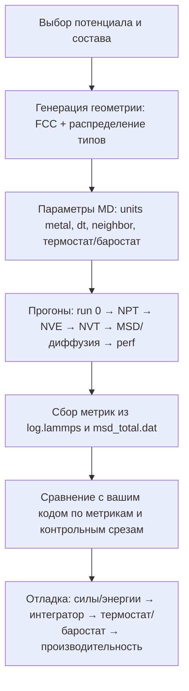
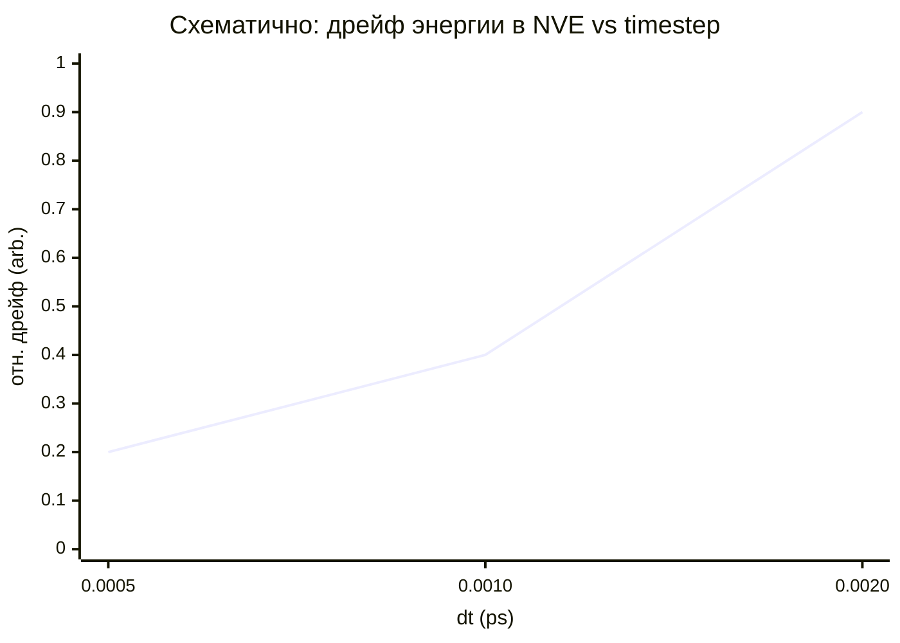
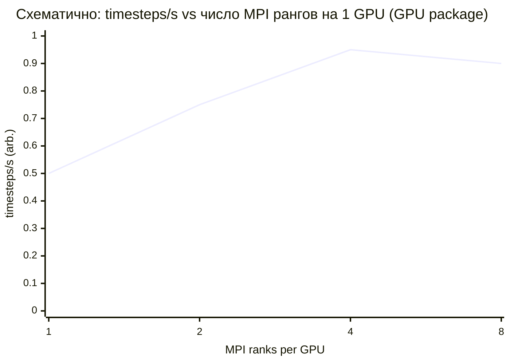

# Бенчмарк MD для многокомпонентных металлических систем с EAM-потенциалами в формате LAMMPS

## Executive summary

Цель предлагаемого бенчмарка — дать **воспроизводимый, “тяжёлый” по числу атомных типов и понятный по физике** тестовый кейс для валидации вашего MD‑кода с **декомпозицией по времени**: (а) корректность сил/энергий/термодинамики, (б) устойчивость интегрирования (дрейф энергии), (в) стабильность термостатирования/баростатирования, (г) диффузионные метрики, (д) производительность на **одной GPU** (включая зависимость от числа MPI‑рангов на один GPU). Локальная “физическая правдоподобность” вторична относительно воспроизводимости и богатства сочетаний типов, но для ряда потенциалов (HEA‑модели) она также приемлема. citeturn16search7turn21search0turn20search8

Ключевое решение для “максимума типов” — использовать **готовый 16‑компонентный** файл EAM/alloy (setfl) из репозитория межатомных потенциалов **entity["organization","NIST","us standards agency"]**, который объединяет 16 металлических элементов (Cu, Ag, Au, Ni, Pd, Pt, Al, Pb, Fe, Mo, Ta, W, Mg, Co, Ti, Zr). Он специально предоставлен “по многочисленным запросам” для многоэлементных/HEA‑симуляций, но с важным предупреждением: **перекрёстные взаимодействия получены универсальной функцией смешения и не все системы тщательно оптимизированы** — зато это отлично подходит для стресс‑теста кода по числу типов. citeturn10view0turn6view0

В качестве “более физичного” эталона для 5‑компонентного ГЦК‑сплава предлагается готовый EAM/alloy файл FeNiCrCoCu (с ZBL‑коррекцией на малых расстояниях, но остающийся в формате `pair_style eam/alloy`), также опубликованный в NIST репозитории с разрешения разработчиков. citeturn15view0turn5view0

Ниже даны: (1) сравнительная таблица кандидатов, (2) готовые **LAMMPS data/input** файлы для 16‑компонентного случая (малый размер) + масштабирование до medium/large, (3) параметры симуляции (units, dt, NVT/NPT, настройки соседей, нюансы GPU), (4) матрица прогонов и строгие метрики (энергетический дрейф, T/P статистики, коэффициенты диффузии, timesteps/s, масштабирование на 1 GPU), (5) команды запуска и точные сниппеты для LAMMPS GPU. citeturn5view0turn23search2turn22search2

## Кандидатные сплавы и EAM‑потенциалы

На практике удобно иметь **два “уровня”**:  
(А) “максимум типов” (16) — чтобы нагрузить ваш код и проверить корректность для множества парных комбинаций;  
(Б) “HEA‑эталон” (3–5 типов) — чтобы метрики диффузии/термостата/баростата были ближе к привычным задачам и калибровались проще. citeturn20search8turn21search0turn21search16

### Сравнение кандидатов

| Кандидат (файл потенциала, стиль) | Состав / число типов | Источник (официальный) | Условия распространения / лицензия (по странице) | Сильные стороны для бенчмарка | Риски/ограничения |
|---|---:|---|---|---|---|
| `CuAgAuNiPdPtAlPbFeMoTaWMgCoTiZr_Zhou04.eam.alloy` (`eam/alloy`) | 16 типов (Cu, Ag, Au, Ni, Pd, Pt, Al, Pb, Fe, Mo, Ta, W, Mg, Co, Ti, Zr) | NIST Interatomic Potentials Repository, объединённый 16‑элементный setfl (Zhou04, retabulation) citeturn10view0turn6view0 | На странице указано, что файл сгенерирован и опубликован в репозитории; присутствует предупреждение о качестве cross‑интеракций; использовать с должным цитированием. citeturn10view0turn16search7 | Максимально “много типов” для EAM/alloy; удобно для теста парсеров, таблиц типов, коммуникаций и нагрузочного теста. citeturn10view0turn5view0 | Cross‑взаимодействия по универсальному смешению и “многие бинарные/много-компонентные системы могут быть плохо оптимизированы”. citeturn10view0turn6view0 |
| `FeNiCrCoCu-with-ZBL.eam.alloy` (`eam/alloy`) | 5 типов (ГЦК HEA, эквиатомный идеализированный Fe‑Ni‑Cr‑Co‑Cu) | NIST entry (Deluigi et al., 2021): модификация более раннего файла с добавленной ZBL‑коррекцией “на малых расстояниях”. citeturn15view0 | На странице: “предоставлено Diana Farkas … опубликовано с разрешения”. citeturn15view0 | Хороший “реалистичный” HEA‑кейс; 5 типов достаточно для проверки многокомпонентности, но стабильнее/понятнее, чем 16‑типовый стресс‑тест. citeturn15view0turn5view0 | Как и многие HEA‑модели, “скорее напоминает, чем точно моделирует”; проверять применимость под вашу задачу. citeturn16search7turn15view0 |
| `FeNiCrCoAl-heaweight.setfl` (`eam/alloy`) | 5 типов (Fe‑Ni‑Cr‑Co‑Al) | NIST entry (Farkas & Caro, 2020). citeturn18view0 | На странице: “sent by … posted with her permission”. citeturn18view0 | Альтернатива HEA‑кейсy: даёт другой характер хим.упорядочения (Al‑эффект) и проверяет чувствительность термодинамики/структуры. citeturn18view0 | Может проявлять выраженное short‑range ordering и фазовые тенденции; надо аккуратно выбирать T и протокол релаксации. citeturn18view0 |
| `Ni-Co-Cr_v1.eam.fs` (`eam/fs`) | 3 типа (Ni‑Co‑Cr) | NIST entry (Mendelev, 2024): потенциал под пластическую деформацию NiCoCr; формат Finnis–Sinclair (`eam/fs`). citeturn16search4turn5view0 | Файл предоставлен автором (по странице). citeturn16search4 | Быстрый/стабильный 3‑компонентный эталон; удобен как “санити‑чек” и для производительности/масштабирования. citeturn16search4turn5view0 | Всего 3 типа: слабее нагружает многотипную логику вашего кода, чем 5/16. citeturn16search4 |

Замечание по совместимости с GPU: `eam/alloy` и `eam/fs` имеют ускоренные реализации, помеченные как GPU‑совместимые. citeturn5view0

Также важно: репозиторий NIST прямо заявляет, что предоставляет потенциалы/сопутствующие файлы и инструменты оценки, и рекомендует пользователям **скачивать и использовать потенциалы с корректным указанием источников**, а разработчикам — добавлять новые потенциалы. citeturn16search7

## Геометрия и LAMMPS‑ready файлы

Ниже дан **готовый LAMMPS data‑файл** для “FCC16” (256 атомов, 16 типов, равные числа атомов каждого типа), а также рекомендуемый способ масштабирования до medium/large через `replicate`. Выбор ГЦК‑решётки объясняется практичностью: это компактная, стандартная геометрия, удобная для воспроизводимых тестов, особенно при использовании `units metal` и EAM‑потенциалов. citeturn20search8turn19search3turn10view0

image_group{"layout":"carousel","aspect_ratio":"16:9","query":["FCC crystal structure unit cell atoms visualization","high entropy alloy fcc random solid solution ovito visualization","LAMMPS EAM alloy potential file example","molecular dynamics fcc supercell atomistic visualization"],"num_per_query":1}

### Модель FCC16

**Кристалл/суперячейка:** ГЦК, параметр решётки `a = 3.60 Å`, суперячейка 4×4×4 по конвенциональной ГЦК ячейке (итого 4 атома/ячейку → 256 атомов). Типы 1..16 распределены случайной перестановкой с фиксированным seed=12345, при этом **строго по 16 атомов каждого типа** (то есть точно равная композиция для 16 типов при данном размере). citeturn20search8turn10view0

**Соответствие типов элементам (для `CuAgAuNiPdPtAlPbFeMoTaWMgCoTiZr_Zhou04.eam.alloy`):**  
1 Cu, 2 Ag, 3 Au, 4 Ni, 5 Pd, 6 Pt, 7 Al, 8 Pb, 9 Fe, 10 Mo, 11 Ta, 12 W, 13 Mg, 14 Co, 15 Ti, 16 Zr. citeturn10view0turn5view0

**Массы** заданы как стандартные атомные веса (g/mol). Их можно брать из таблиц атомных весов NIST/IUPAC; ниже приведён фиксированный набор значений, достаточный для воспроизводимого MD‑прогона. citeturn24search0turn20search8

### LAMMPS data‑файл

**Файл:** `fcc16_4x4x4.data`

```text
LAMMPS data file: FCC16 random solid solution (seed=12345), a=3.60 Å, 4x4x4 conventional cells

256 atoms
16 atom types

0.000000 14.400000 xlo xhi
0.000000 14.400000 ylo yhi
0.000000 14.400000 zlo zhi

Masses

1 63.54600000 # Cu
2 107.86820000 # Ag
3 196.96657000 # Au
4 58.69340000 # Ni
5 106.42000000 # Pd
6 195.08400000 # Pt
7 26.98153850 # Al
8 207.20000000 # Pb
9 55.84500000 # Fe
10 95.95000000 # Mo
11 180.94788000 # Ta
12 183.84000000 # W
13 24.30500000 # Mg
14 58.93319400 # Co
15 47.86700000 # Ti
16 91.22400000 # Zr

Atoms # atomic

1 3 0.000000 0.000000 0.000000
2 5 0.000000 1.800000 1.800000
3 5 1.800000 0.000000 1.800000
4 16 1.800000 1.800000 0.000000
5 3 3.600000 0.000000 0.000000
6 10 3.600000 1.800000 1.800000
7 11 5.400000 0.000000 1.800000
8 13 5.400000 1.800000 0.000000
9 1 7.200000 0.000000 0.000000
10 4 7.200000 1.800000 1.800000
11 2 9.000000 0.000000 1.800000
12 16 9.000000 1.800000 0.000000
13 8 10.800000 0.000000 0.000000
14 5 10.800000 1.800000 1.800000
15 15 12.600000 0.000000 1.800000
16 16 12.600000 1.800000 0.000000
17 6 0.000000 3.600000 0.000000
18 9 0.000000 5.400000 1.800000
19 6 1.800000 3.600000 1.800000
20 7 1.800000 5.400000 0.000000
21 5 3.600000 3.600000 0.000000
22 10 3.600000 5.400000 1.800000
23 13 5.400000 3.600000 1.800000
24 4 5.400000 5.400000 0.000000
25 6 7.200000 3.600000 0.000000
26 15 7.200000 5.400000 1.800000
27 12 9.000000 3.600000 1.800000
28 2 9.000000 5.400000 0.000000
29 8 10.800000 3.600000 0.000000
30 8 10.800000 5.400000 1.800000
31 7 12.600000 3.600000 1.800000
32 14 12.600000 5.400000 0.000000
33 2 0.000000 7.200000 0.000000
34 12 0.000000 9.000000 1.800000
35 11 1.800000 7.200000 1.800000
36 13 1.800000 9.000000 0.000000
37 2 3.600000 7.200000 0.000000
38 1 3.600000 9.000000 1.800000
39 3 5.400000 7.200000 1.800000
40 1 5.400000 9.000000 0.000000
41 1 7.200000 7.200000 0.000000
42 13 7.200000 9.000000 1.800000
43 12 9.000000 7.200000 1.800000
44 13 9.000000 9.000000 0.000000
45 15 10.800000 7.200000 0.000000
46 4 10.800000 9.000000 1.800000
47 11 12.600000 7.200000 1.800000
48 5 12.600000 9.000000 0.000000
49 11 0.000000 10.800000 0.000000
50 14 0.000000 12.600000 1.800000
51 7 1.800000 10.800000 1.800000
52 15 1.800000 12.600000 0.000000
53 12 3.600000 10.800000 0.000000
54 8 3.600000 12.600000 1.800000
55 6 5.400000 10.800000 1.800000
56 4 5.400000 12.600000 0.000000
57 6 7.200000 10.800000 0.000000
58 4 7.200000 12.600000 1.800000
59 9 9.000000 10.800000 1.800000
60 15 9.000000 12.600000 0.000000
61 1 10.800000 10.800000 0.000000
62 12 10.800000 12.600000 1.800000
63 9 12.600000 10.800000 1.800000
64 8 12.600000 12.600000 0.000000
65 14 0.000000 0.000000 3.600000
66 2 0.000000 1.800000 5.400000
67 14 1.800000 0.000000 5.400000
68 16 1.800000 1.800000 3.600000
69 10 3.600000 0.000000 3.600000
70 4 3.600000 1.800000 5.400000
71 11 5.400000 0.000000 5.400000
72 7 5.400000 1.800000 3.600000
73 12 7.200000 0.000000 3.600000
74 3 7.200000 1.800000 5.400000
75 3 9.000000 0.000000 5.400000
76 7 9.000000 1.800000 3.600000
77 2 10.800000 0.000000 3.600000
78 14 10.800000 1.800000 5.400000
79 12 12.600000 0.000000 5.400000
80 10 12.600000 1.800000 3.600000
81 2 0.000000 3.600000 3.600000
82 6 0.000000 5.400000 5.400000
83 5 1.800000 3.600000 5.400000
84 15 1.800000 5.400000 3.600000
85 9 3.600000 3.600000 3.600000
86 11 3.600000 5.400000 5.400000
87 10 5.400000 3.600000 5.400000
88 6 5.400000 5.400000 3.600000
89 15 7.200000 3.600000 3.600000
90 4 7.200000 5.400000 5.400000
91 13 9.000000 3.600000 5.400000
92 12 9.000000 5.400000 3.600000
93 3 10.800000 3.600000 3.600000
94 9 10.800000 5.400000 5.400000
95 6 12.600000 3.600000 5.400000
96 8 12.600000 5.400000 3.600000
97 1 0.000000 7.200000 3.600000
98 14 0.000000 9.000000 5.400000
99 10 1.800000 7.200000 5.400000
100 1 1.800000 9.000000 3.600000
101 6 3.600000 7.200000 3.600000
102 10 3.600000 9.000000 5.400000
103 4 5.400000 7.200000 5.400000
104 7 5.400000 9.000000 3.600000
105 9 7.200000 7.200000 3.600000
106 11 7.200000 9.000000 5.400000
107 8 9.000000 7.200000 5.400000
108 2 9.000000 9.000000 3.600000
109 5 10.800000 7.200000 3.600000
110 3 10.800000 9.000000 5.400000
111 13 12.600000 7.200000 5.400000
112 6 12.600000 9.000000 3.600000
113 3 0.000000 10.800000 3.600000
114 1 0.000000 12.600000 5.400000
115 14 1.800000 10.800000 5.400000
116 16 1.800000 12.600000 3.600000
117 15 3.600000 10.800000 3.600000
118 8 3.600000 12.600000 5.400000
119 9 5.400000 10.800000 5.400000
120 13 5.400000 12.600000 3.600000
121 15 7.200000 10.800000 3.600000
122 11 7.200000 12.600000 5.400000
123 10 9.000000 10.800000 5.400000
124 2 9.000000 12.600000 3.600000
125 5 10.800000 10.800000 3.600000
126 9 10.800000 12.600000 5.400000
127 5 12.600000 10.800000 5.400000
128 14 12.600000 12.600000 3.600000
129 12 0.000000 0.000000 7.200000
130 15 0.000000 1.800000 9.000000
131 6 1.800000 0.000000 9.000000
132 11 1.800000 1.800000 7.200000
133 13 3.600000 0.000000 7.200000
134 4 3.600000 1.800000 9.000000
135 2 5.400000 0.000000 9.000000
136 4 5.400000 1.800000 7.200000
137 8 7.200000 0.000000 7.200000
138 1 7.200000 1.800000 9.000000
139 4 9.000000 0.000000 9.000000
140 15 9.000000 1.800000 7.200000
141 12 10.800000 0.000000 7.200000
142 10 10.800000 1.800000 9.000000
143 9 12.600000 0.000000 9.000000
144 7 12.600000 1.800000 7.200000
145 1 0.000000 3.600000 7.200000
146 9 0.000000 5.400000 9.000000
147 7 1.800000 3.600000 9.000000
148 11 1.800000 5.400000 7.200000
149 4 3.600000 3.600000 7.200000
150 6 3.600000 5.400000 9.000000
151 3 5.400000 3.600000 9.000000
152 10 5.400000 5.400000 7.200000
153 5 7.200000 3.600000 7.200000
154 10 7.200000 5.400000 9.000000
155 6 9.000000 3.600000 9.000000
156 13 9.000000 5.400000 7.200000
157 10 10.800000 3.600000 7.200000
158 16 10.800000 5.400000 9.000000
159 8 12.600000 3.600000 9.000000
160 6 12.600000 5.400000 7.200000
161 14 0.000000 7.200000 7.200000
162 16 0.000000 9.000000 9.000000
163 12 1.800000 7.200000 9.000000
164 7 1.800000 9.000000 7.200000
165 13 3.600000 7.200000 7.200000
166 13 3.600000 9.000000 9.000000
167 2 5.400000 7.200000 9.000000
168 14 5.400000 9.000000 7.200000
169 11 7.200000 7.200000 7.200000
170 6 7.200000 9.000000 9.000000
171 14 9.000000 7.200000 9.000000
172 4 9.000000 9.000000 7.200000
173 11 10.800000 7.200000 7.200000
174 14 10.800000 9.000000 9.000000
175 7 12.600000 7.200000 9.000000
176 12 12.600000 9.000000 7.200000
177 4 0.000000 10.800000 7.200000
178 9 0.000000 12.600000 9.000000
179 3 1.800000 10.800000 9.000000
180 1 1.800000 12.600000 7.200000
181 4 3.600000 10.800000 7.200000
182 16 3.600000 12.600000 9.000000
183 7 5.400000 10.800000 9.000000
184 16 5.400000 12.600000 7.200000
185 4 7.200000 10.800000 7.200000
186 5 7.200000 12.600000 9.000000
187 6 9.000000 10.800000 9.000000
188 9 9.000000 12.600000 7.200000
189 11 10.800000 10.800000 7.200000
190 2 10.800000 12.600000 9.000000
191 5 12.600000 10.800000 9.000000
192 16 12.600000 12.600000 7.200000
193 1 0.000000 0.000000 10.800000
194 4 0.000000 1.800000 12.600000
195 9 1.800000 0.000000 12.600000
196 3 1.800000 1.800000 10.800000
197 11 3.600000 0.000000 10.800000
198 5 3.600000 1.800000 12.600000
199 12 5.400000 0.000000 12.600000
200 14 5.400000 1.800000 10.800000
201 13 7.200000 0.000000 10.800000
202 11 7.200000 1.800000 12.600000
203 7 9.000000 0.000000 12.600000
204 1 9.000000 1.800000 10.800000
205 3 10.800000 0.000000 10.800000
206 8 10.800000 1.800000 12.600000
207 2 12.600000 0.000000 12.600000
208 10 12.600000 1.800000 10.800000
209 11 0.000000 3.600000 10.800000
210 6 0.000000 5.400000 12.600000
211 13 1.800000 3.600000 12.600000
212 3 1.800000 5.400000 10.800000
213 13 3.600000 3.600000 10.800000
214 15 3.600000 5.400000 12.600000
215 15 5.400000 3.600000 12.600000
216 14 5.400000 5.400000 10.800000
217 12 7.200000 3.600000 10.800000
218 8 7.200000 5.400000 12.600000
219 12 9.000000 3.600000 12.600000
220 9 9.000000 5.400000 10.800000
221 11 10.800000 3.600000 10.800000
222 7 10.800000 5.400000 12.600000
223 16 12.600000 3.600000 12.600000
224 15 12.600000 5.400000 10.800000
225 2 0.000000 7.200000 10.800000
226 6 0.000000 9.000000 12.600000
227 5 1.800000 7.200000 12.600000
228 3 1.800000 9.000000 10.800000
229 14 3.600000 7.200000 10.800000
230 16 3.600000 9.000000 12.600000
231 13 5.400000 7.200000 12.600000
232 2 5.400000 9.000000 10.800000
233 12 7.200000 7.200000 10.800000
234 11 7.200000 9.000000 12.600000
235 8 9.000000 7.200000 12.600000
236 11 9.000000 9.000000 10.800000
237 10 10.800000 7.200000 10.800000
238 7 10.800000 9.000000 12.600000
239 16 12.600000 7.200000 12.600000
240 1 12.600000 9.000000 10.800000
241 12 0.000000 10.800000 10.800000
242 8 0.000000 12.600000 12.600000
243 13 1.800000 10.800000 12.600000
244 9 1.800000 12.600000 10.800000
245 13 3.600000 10.800000 10.800000
246 1 3.600000 12.600000 12.600000
247 15 5.400000 10.800000 12.600000
248 10 5.400000 12.600000 10.800000
249 8 7.200000 10.800000 10.800000
250 15 7.200000 12.600000 12.600000
251 15 9.000000 10.800000 12.600000
252 2 9.000000 12.600000 10.800000
253 4 10.800000 10.800000 10.800000
254 14 10.800000 12.600000 12.600000
255 14 12.600000 10.800000 12.600000
256 6 12.600000 12.600000 10.800000
```

Файл совместим с `atom_style atomic` и `units metal` (Angstrom, ps, eV; давление в bar). citeturn20search8turn20search0

### Масштабирование размеров

Рекомендуется держать **три масштаба**:

- **Small:** 256 атомов (как выше) — сверка сил/энергий “атом‑в‑атом”, быстрые прогоны.  
- **Medium:** 256 × 4³ = 16384 атомов (через `replicate 4 4 4`).  
- **Large:** 256 × 8³ = 131072 атомов (через `replicate 8 8 8`) — типично достаточно, чтобы загрузить GPU и получить устойчивые измерения timesteps/s. citeturn22search6turn5view2turn26view0

## Протокол симуляции и настройки для одной GPU

### Единицы, шаг интегрирования и ансамбли

- **Единицы:** `units metal`. В этом режиме LAMMPS использует Å для длины, ps для времени, eV для энергии и bar для давления. citeturn20search8turn20search0  
- **Шаг:** стартовая рекомендация **1 fs** (`timestep 0.001` в ps). Это типичный выбор для металлических систем; в русскоязычной публикации по MD на металлах с EAM и термостатом Нозе–Гувера явно использован шаг 1 фс. citeturn25view0turn20search18  
- **Термостат/баростат:** базовый вариант — детерминированные ансамбли Nose–Hoover через `fix nvt`/`fix npt` (команда `fix_nh`). citeturn21search0turn21search3turn21search4

### Настройки соседей (neighbor/neigh_modify)

Для EAM‑потенциалов производительность чувствительна к (а) skin, (б) частоте перестройки списков соседей; LAMMPS подчёркивает компромисс “skin vs rebuild frequency” и рекомендует начинать с консервативных настроек. citeturn20search1turn20search4turn22search6turn20search21

Практичный старт (консервативно, безопасно):
- `neighbor 2.0 bin`  
- `neigh_modify every 1 delay 0 check yes` citeturn20search1turn20search4

Дальше (для performance‑бенчмарка) можно исследовать `every 10` при том же skin и проверять “dangerous builds”/статистику соседей в выводе. citeturn20search21turn22search6

### GPU‑режим: что важно для “single‑GPU LAMMPS”

1) **`eam/alloy` и `eam/fs` ускоряются на GPU.** Это явно отмечено в списке парных стилей (маркер g). citeturn5view0  

2) **GPU package: режимы точности** (single/mixed/double) выбираются при сборке; mixed — дефолт. citeturn5view1  
   В русскоязычной инструкции по эксплуатации LAMMPS на суперкомпьютере **entity["organization","НИУ ВШЭ","russian university"]** отмечено, что GPU‑сборка может использовать смешанную точность (FP32/FP64) как инженерный компромисс “скорость/корректность”. citeturn26view0turn5view1  

3) **Число MPI‑рангов на один GPU:** документация по ускорителям отмечает, что GPU‑пакет часто выигрывает от нескольких MPI‑процессов на один GPU (примерный диапазон 2–8), потому что часть работы остаётся на CPU и может распараллеливаться MPI. citeturn5view2turn23search7

4) **Ограничение: `package gpu … neigh yes` и triclinic box.** Для построения соседей на GPU есть ограничение: нельзя использовать triclinic ящик, что документируется как “current restriction”. Поэтому базовый бенчмарк выше намеренно ортогонален. citeturn23search3turn23search2

5) **GPU vs KOKKOS:** LAMMPS подчёркивает различия: GPU‑пакет пересылает per‑atom данные CPU↔GPU каждый шаг, тогда как KOKKOS старается держать данные на GPU и может быть быстрее при полностью “GPU‑изированном” инпуте. Это полезно для интерпретации ваших измерений timesteps/s и выбора “эталона производительности”. citeturn5view2turn23search7

## Воспроизводимые прогоны и метрики сравнения

Ниже описан минимальный, но полный “набор прогонов” (test suite), который удобно запускать как на CPU‑эталоне, так и на GPU‑эталоне, а затем воспроизводить в вашем коде.

### Набор прогонов

**Прогон A — проверка сил/энергии на шаге 0 (детерминированный контроль):**  
Считать data‑файл, назначить потенциал, выполнить `run 0` и сравнить:
- потенциальную энергию (PE), давление/вириал,
- вектор сил на атомах (если вы дополнительно выводите силы).  
`run 0` в LAMMPS выполняет инициализацию без “реального” продвижения времени, что удобно как контрольная точка. (Смысл `setup()` и требований velocity‑Verlet к силам до первого шага описан в developer‑документации.) citeturn27search17turn22search2

**Прогон B — NPT релаксация объёма (300 K, 0 bar):**  
Цель — убрать стартовое несоответствие плотности/напряжений. Использовать Nose–Hoover NPT (`fix npt`). citeturn21search0turn21search4turn20search8

**Прогон C — NVE дрейф энергии:**  
Стартовать из состояния после NPT релаксации. Мерить дрейф `etotal` во времени. citeturn22search1turn20search18

**Прогон D — NVT стабильность температуры:**  
Тот же старт (или после короткого NPT), затем NVT. Снимать среднюю T, σ(T), автокорреляции (при желании). citeturn21search0turn21search3turn22search1

**Прогон E — диффузия (MSD → D):**  
Для диффузии нужна достаточно высокая мобильность: либо высокая температура (часто ближе к предприятию диффузии), либо жидкая фаза. Практически: выбрать T выше, чем в релаксации, и считать MSD через `compute msd`; коэффициент диффузии связан с наклоном MSD. LAMMPS прямо указывает, что наклон MSD пропорционален D, и даёт how‑to по вычислению коэффициента диффузии. citeturn21search20turn21search16

**Прогон F — производительность и масштабирование на 1 GPU:**  
Повторить короткий NVE/NVT (без частого I/O), замерять:
- `spcpu` (timesteps per CPU second) из `thermo_style`,
- итоговый “Performance: … timesteps/s” из финального summary,
- зависимость timesteps/s от числа MPI‑рангов на один GPU (1,2,4,8). citeturn22search1turn22search2turn5view2turn23search7

### Определения метрик для сравнения с вашим кодом

**Дрейф энергии (NVE):**  
Рекомендуется сравнивать по двум формам:

- Абсолютный дрейф на атом за время:
\[
\dot{e}=\frac{E(t_{end})-E(t_{start})}{N\,(t_{end}-t_{start})}
\]
в eV/(atom·ps) или eV/(atom·ns).  

- Относительный дрейф:
\[
\Delta E_{rel}=\frac{E(t_{end})-E(t_{start})}{|E(t_{start})|}
\]

В идеале дрейф должен уменьшаться при уменьшении `dt`; для ваших проверок полезно прогнать dt‑sweep (0.0005/0.001/0.002 ps). citeturn20search18turn22search1

**Стабильность температуры (NVT):**  
После периода разогрева/приработки (например 20–50 ps) сравнивать:
- среднее \(\langle T \rangle\),
- стандартное отклонение \(\sigma_T\),
- отсутствие систематического тренда.  
Nose–Hoover NVT в LAMMPS реализуется через `fix nvt` (семейство `fix_nh`). citeturn21search0turn21search3

**Давление и объём (NPT):**  
Сравнивать среднее давление \(\langle P \rangle\), компоненты (pxx, pyy, pzz) и \(\langle V \rangle\), \(\sigma_V\), сохраняя одинаковые barostat damping параметры. citeturn21search0turn21search4turn22search1

**Диффузия:**  
Использовать Einstein‑отношение через MSD. В LAMMPS `compute msd` выдаёт компоненты MSD и общий MSD; наклон MSD по времени пропорционален D. citeturn21search20turn21search16

**Производительность:**  
Использовать две независимые величины:
- `spcpu` из `thermo_style` — “on‑the‑fly” timesteps per CPU second. citeturn22search1  
- “Performance: … timesteps/s” в конце run. citeturn22search2  

И сравнивать **скорость на шаг** и **катом‑шаг/с (katom-step/s)**, если выводится. citeturn22search2

### Воспроизводимость начальных скоростей

Для строгой воспроизводимости важно, как генерируются начальные скорости. Команда `velocity … create` использует RNG с заданным seed. citeturn27search0  
Если вы хотите, чтобы генерация скоростей была независима от числа MPI‑процессов, используйте опцию `loop geom` (геометрически‑детерминированная привязка), что явно описано в исходниках LAMMPS: “GEOM … will always produce same V, independent of P”. citeturn27search11

## Точные инпут‑сниппеты и команды запуска на LAMMPS GPU

Ниже — минимальный рабочий инпут для полного цикла: NPT релаксация → NVE дрейф → NVT стабильность → MSD для диффузии. Он заточен под FCC16 и потенциал `CuAgAuNiPdPtAlPbFeMoTaWMgCoTiZr_Zhou04.eam.alloy`. (Файлы потенциалов берите со страниц NIST entry — ссылки кликабельны по источнику.) citeturn10view0turn5view0

**Файл:** `in.fcc16_suite.in`

```lammps
# ---------- FCC16 benchmark suite ----------
units           metal
atom_style      atomic
boundary        p p p

read_data       fcc16_4x4x4.data

# Optional scaling: set replicate factors (1=small)
variable        r equal 1
replicate       ${r} ${r} ${r}

# Potential: 16-element EAM/alloy (setfl)
pair_style      eam/alloy
pair_coeff      * * CuAgAuNiPdPtAlPbFeMoTaWMgCoTiZr_Zhou04.eam.alloy \
                Cu Ag Au Ni Pd Pt Al Pb Fe Mo Ta W Mg Co Ti Zr

# Neighbor settings (conservative)
neighbor        2.0 bin
neigh_modify    every 1 delay 0 check yes

# Timestep
timestep        0.001

# Thermo output incl. performance metric spcpu
thermo          200
thermo_style    custom step time temp pe ke etotal press pxx pyy pzz vol density spcpu
thermo_modify   flush yes

# Deterministic velocity initialization independent of MPI size (loop geom)
velocity        all create 300.0 123456 mom yes rot yes dist gaussian loop geom

# ---------- Stage 0: run 0 (init check) ----------
run             0

# ---------- Stage 1: NPT relax (300 K, 0 bar) ----------
fix             fNPT all npt temp 300.0 300.0 0.1 iso 0.0 0.0 1.0
run             20000
unfix           fNPT
write_restart   rst.after_npt

# ---------- Stage 2: NVE drift ----------
reset_timestep  0
fix             fNVE all nve
run             50000
unfix           fNVE
write_restart   rst.after_nve

# ---------- Stage 3: NVT stability ----------
reset_timestep  0
fix             fNVT all nvt temp 300.0 300.0 0.1
run             50000
unfix           fNVT
write_restart   rst.after_nvt

# ---------- Stage 4: diffusion via MSD at higher T (example 1200 K) ----------
reset_timestep  0
velocity        all scale 1200.0
fix             fNVT2 all nvt temp 1200.0 1200.0 0.1
compute         cMSD all msd com yes
fix             fMSD all ave/time 100 10 1000 c_cMSD[4] file msd_total.dat
run             200000
unfix           fMSD
uncompute       cMSD
unfix           fNVT2

write_restart   rst.final
```

Команды здесь опираются на: `units metal`, `timestep`, `neighbor`, `neigh_modify`, `fix nvt/npt` (семейство Nose–Hoover), `compute msd` и how‑to по диффузии, а также `thermo_style` (включая `spcpu`). citeturn20search8turn20search18turn20search1turn20search4turn21search0turn21search20turn21search16turn22search1

### Таблица: сниппеты и команды запуска (CPU vs GPU)

| Цель | Ключевые настройки/сниппет | CPU команда | GPU команда (GPU package) |
|---|---|---|---|
| Базовый прогон (small) | `variable r equal 1` | `mpirun -np 1 lmp -in in.fcc16_suite.in` | `mpirun -np 4 lmp -sf gpu -pk gpu 1 neigh yes -in in.fcc16_suite.in` |
| Масштабирование до medium | `variable r equal 4` | `mpirun -np 1 lmp -var r 4 -in in.fcc16_suite.in` | `mpirun -np 4 lmp -sf gpu -pk gpu 1 neigh yes -var r 4 -in in.fcc16_suite.in` |
| Масштабирование до large | `variable r equal 8` | `mpirun -np 1 lmp -var r 8 -in in.fcc16_suite.in` | `mpirun -np 4 lmp -sf gpu -pk gpu 1 neigh yes -var r 8 -in in.fcc16_suite.in` |
| GPU‑скейлинг (1 GPU) | фиксируйте `r`, меняйте `-np` | `mpirun -np {1,2,4,8} ...` | `mpirun -np {1,2,4,8} lmp -sf gpu -pk gpu 1 neigh yes ...` |

`eam/alloy` GPU‑совместим, а включение GPU‑ускорения делается через suffix/`-sf gpu` и параметры GPU‑пакета (в т.ч. `neigh yes`). citeturn5view0turn23search2turn23search7

Практическая подсказка (из русскоязычной HPC‑инструкции): пример запуска на GPU часто выглядит как `lmp -sf gpu -pk gpu $SLURM_GPUS -in …`, а для KOKKOS‑варианта — `-sf kk -k on g 1`. citeturn26view0turn5view2

## Ожидаемые тренды и workflow сравнения с вашим time‑decomposition кодом

### Mermaid workflow



Логика соответствует тому, как LAMMPS организует ансамбли Nose–Hoover (NVT/NPT) и как рекомендует измерять производительность/настраивать ускорители. citeturn21search0turn22search2turn5view2

### Mermaid‑чарты ожидаемых трендов (схематично)





Почему ожидается “рост → плато → иногда спад”: LAMMPS отмечает, что GPU‑пакет может выигрывать от нескольких MPI‑рангов на один GPU, но эффективность зависит от CPU↔GPU пропускной способности и доли не‑GPU кода, поэтому после некоторой точки накладные расходы доминируют. citeturn5view2turn23search7turn22search6

### Как сопоставлять с вашим time‑decomposition кодом

1) **Контроль силы/энергии на одном шаге (самый “жёсткий” тест):**  
   Сделайте “снимок” состояния (позиции, типы, боксы) и сравните силы/PE при `run 0`/первом force‑evaluation. Для time‑decomposition это крайне полезно: вы ловите ошибки в потенциале/соседях/табличной интерполяции до того, как накопятся расхождения траекторий. citeturn27search17turn20search17turn5view0

2) **Интегратор:**  
   На одинаковом `dt` и одинаковой точности (CPU vs GPU могут давать небольшие расхождения из‑за порядка суммирования) сравнивайте дрейф энергии и статистику T/P. LAMMPS предупреждает, что ускоренные версии стилей “функционально одинаковы”, отличия возможны из‑за округления/точности. citeturn23search22turn5view1turn5view2

3) **Термостат/баростат:**  
   Для воспроизводимости и сравнения лучше начинать с детерминированных Nose–Hoover (NVT/NPT) и фиксированных параметров damp. citeturn21search0turn21search4

4) **Диффузия:**  
   Для time‑decomposition траектории могут расходиться, но MSD‑наклон (после достаточно длинного времени и усреднения) должен быть сопоставим при равных ансамблях/параметрах. Методику MSD↔D в LAMMPS рекомендуется реализовывать по how‑to и `compute msd`. citeturn21search16turn21search20

5) **Производительность:**  
   Для эталона LAMMPS записывайте `spcpu` в thermo и итоговые `timesteps/s`. Для вашего кода фиксируйте “эквивалент timesteps/s” и измеряйте scaling по числу time‑рангов (если применимо) отдельно от spatial/GPU‑параллелизма. Формат и смысл метрик `spcpu`/`tpcpu` описаны в `thermo_style`, а суммарная строка производительности — в разделе output. citeturn22search1turn22search2

## Русскоязычные источники и контекст

Для краткого русскоязычного определения EAM можно опираться на “Модель погружённого атома” (описание энергии как функции embedding‑термина от суммарной электронной плотности соседей плюс парный вклад). citeturn19search3

Практика типичных параметров MD на металлах (EAM + LAMMPS): в русскоязычной статье по моделированию металлических систем указаны шаг интегрирования **1 фс** и использование термостата Нозе–Гувера. citeturn25view0

Отдельно, русскоязычная HPC‑инструкция по LAMMPS (примерно‑прикладной уровень) полезна тем, что прямо показывает схемы запуска GPU‑вариантов (`-sf gpu -pk gpu …`) и обсуждает сборки с CUDA/KOKKOS/GPU‑пакетами. citeturn26view0turn5view1turn5view2